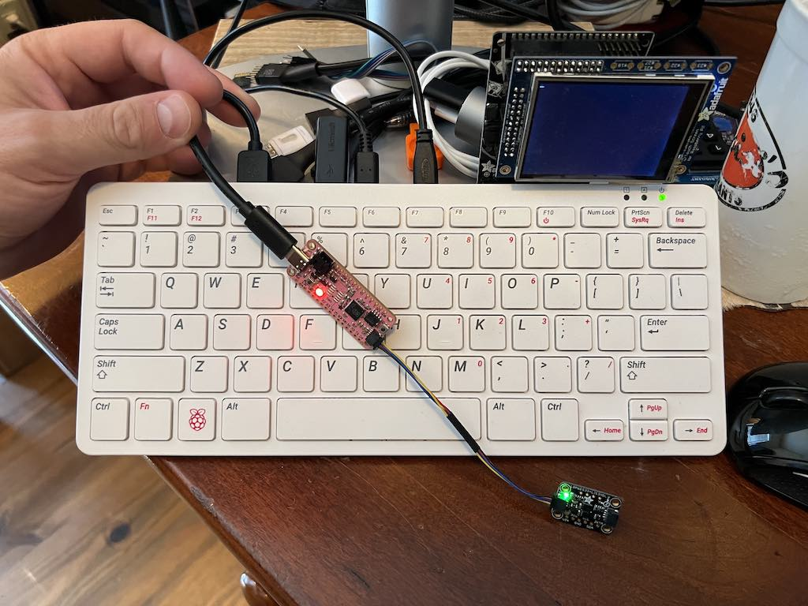

# imu_logger
IMU logging tool

# Hardware
I'm using a adafruit feather [rp2040](https://www.adafruit.com/product/4884) and im programming it from a [pi400](https://www.adafruit.com/product/4795)


# Getting started
First plug your RP2040 into your raspberry pi as shown in the hardware section

After you plugin you can run the dmesg command and see what the device handle is, in my case its 'sdb'
```shell
pi@raspberrypi:/media $ dmesg | grep '] sd'
[    1.553675] sdhci: Secure Digital Host Controller Interface driver
[    1.554791] sdhci: Copyright(c) Pierre Ossman
[    1.558475] sdhci-pltfm: SDHCI platform and OF driver helper
[  148.640341] sd 0:0:0:0: [sda] 14337 512-byte logical blocks: (7.34 MB/7.00 MiB)
[  148.642709] sd 0:0:0:0: [sda] Write Protect is off
[  148.642732] sd 0:0:0:0: [sda] Mode Sense: 03 00 00 00
[  148.645197] sd 0:0:0:0: [sda] No Caching mode page found
[  148.645218] sd 0:0:0:0: [sda] Assuming drive cache: write through
[  148.665532] sd 0:0:0:0: Attached scsi generic sg0 type 0
[  148.709165] sd 0:0:0:0: [sda] Attached SCSI removable disk
[  608.723926] sd 1:0:0:0: Attached scsi generic sg0 type 0
[  608.724777] sd 1:0:0:0: [sdb] 14337 512-byte logical blocks: (7.34 MB/7.00 MiB)
[  608.726868] sd 1:0:0:0: [sdb] Write Protect is off
[  608.726890] sd 1:0:0:0: [sdb] Mode Sense: 03 00 00 00
[  608.729362] sd 1:0:0:0: [sdb] No Caching mode page found
[  608.729382] sd 1:0:0:0: [sdb] Assuming drive cache: write through
[  608.785394] sd 1:0:0:0: [sdb] Attached SCSI removable disk
[43206.732827] sd 1:0:0:0: Attached scsi generic sg0 type 0
[43206.733961] sd 1:0:0:0: [sdb] 14337 512-byte logical blocks: (7.34 MB/7.00 MiB)
[43206.736056] sd 1:0:0:0: [sdb] Write Protect is off
[43206.736072] sd 1:0:0:0: [sdb] Mode Sense: 03 00 00 00
[43206.738556] sd 1:0:0:0: [sdb] No Caching mode page found
[43206.738571] sd 1:0:0:0: [sdb] Assuming drive cache: write through
[43206.810579] sd 1:0:0:0: [sdb] Attached SCSI removable disk
```